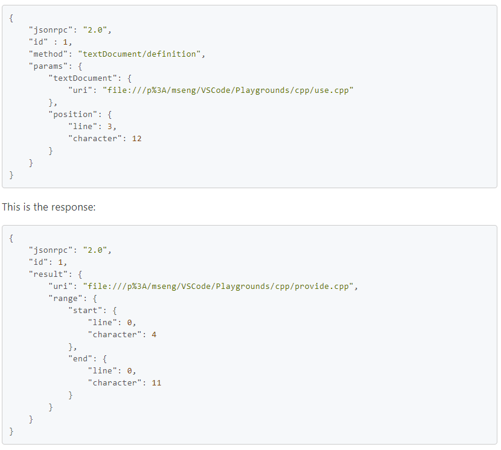

# Language Server Protocol
Language Server Protocol (LSP) กำหนด Protocol ที่ใช้ระหว่าง editor หรือ IDE และ language server ที่ให้คุณสมบัติของภาษาเช่นการเติมข้อความอัตโนมัติไปที่คำจำกัดความค้นหาการอ้างอิงทั้งหมดเป็นต้นเป้าหมายของรูปแบบ Language Server Index Format  (LSIF ออกเสียงเหมือน "else if") คือการสนับสนุนการนำทางด้วยโค้ดที่สมบูรณ์ในเครื่องมือการพัฒนาหรือ Web UI โดยไม่จำเป็นต้องมีสำเนาของซอร์สโค้ดในเครื่อง

## Language Server Protocol คืออะไร?
การเพิ่มคุณสมบัติเช่นการเติมข้อความอัตโนมัติไปที่คำจำกัดความหรือเอกสารเกี่ยวกับการวางเมาส์สำหรับภาษาโปรแกรมนั้นต้องใช้ความพยายามอย่างมาก ตามเนื้อผ้างานนี้จะต้องทำซ้ำสำหรับเครื่องมือการพัฒนาแต่ละตัวเนื่องจากแต่ละเครื่องมือมี API ที่แตกต่างกันสำหรับการใช้งานคุณลักษณะเดียวกัน

เซิร์ฟเวอร์ภาษามีไว้เพื่อจัดหาสมาร์ทเฉพาะภาษาและสื่อสารกับเครื่องมือการพัฒนาผ่านโปรโตคอลที่เปิดใช้งานการสื่อสารระหว่างกระบวนการ

แนวคิดเบื้องหลัง Language Server Protocol (LSP) คือการกำหนดมาตรฐานของโปรโตคอลสำหรับวิธีที่เซิร์ฟเวอร์และเครื่องมือการพัฒนาดังกล่าวสื่อสารกัน ด้วยวิธีนี้เซิร์ฟเวอร์ภาษาเดียวสามารถใช้ซ้ำได้ในเครื่องมือการพัฒนาหลาย ๆ ตัวซึ่งจะสามารถรองรับหลายภาษาได้โดยใช้ความพยายามเพียงเล็กน้อย

LSP ชนะทั้งผู้ให้บริการภาษาและผู้จำหน่ายเครื่องมือ!

## Language Server Protocol คืออะไร?
การใช้งานการสนับสนุนสำหรับคุณลักษณะต่างๆเช่นการเติมข้อความอัตโนมัติคำจำกัดความ goto หรือเอกสารเกี่ยวกับการวางเมาส์สำหรับภาษาโปรแกรมถือเป็นความพยายามครั้งสำคัญ ตามเนื้อผ้างานนี้ต้องทำซ้ำสำหรับเครื่องมือการพัฒนาแต่ละรายการเนื่องจากแต่ละเครื่องมือมี API ที่แตกต่างกันสำหรับการใช้งานคุณลักษณะเดียวกัน

แนวคิดเบื้องหลังเซิร์ฟเวอร์ภาษาคือการจัดหาสมาร์ทเฉพาะภาษาภายในเซิร์ฟเวอร์ที่สามารถสื่อสารกับเครื่องมือการพัฒนาผ่านโปรโตคอลที่เปิดใช้งานการสื่อสารระหว่างกระบวนการ

แนวคิดเบื้องหลัง Language Server Protocol (LSP) คือการกำหนดมาตรฐานของโปรโตคอลสำหรับวิธีการสื่อสารของเครื่องมือและเซิร์ฟเวอร์ดังนั้นเซิร์ฟเวอร์ภาษาเดียวจึงสามารถใช้ซ้ำได้ในเครื่องมือการพัฒนาที่หลากหลายและเครื่องมือสามารถรองรับภาษาได้โดยใช้ความพยายามเพียงเล็กน้อย

LSP ชนะทั้งผู้ให้บริการภาษาและผู้จำหน่ายเครื่องมือ!

## How it works
เซิร์ฟเวอร์ภาษาทำงานเป็นกระบวนการแยกต่างหากและเครื่องมือการพัฒนาสื่อสารกับเซิร์ฟเวอร์โดยใช้โปรโตคอลภาษาผ่าน JSON-RPC ด้านล่างนี้เป็นตัวอย่างวิธีที่เครื่องมือและเซิร์ฟเวอร์ภาษาสื่อสารระหว่างเซสชันการแก้ไขตามปกติ:

  * ผู้ใช้เปิดไฟล์ (เรียกว่าเอกสาร) ในเครื่องมือ: เครื่องมือจะแจ้งเซิร์ฟเวอร์ภาษาว่าเอกสารเปิดอยู่ ("textDocument / didOpen") จากนี้ไปความจริงเกี่ยวกับเนื้อหาของเอกสารไม่ได้อยู่ในระบบไฟล์อีกต่อไป แต่เก็บไว้โดยเครื่องมือในหน่วยความจำ ตอนนี้เนื้อหาจะต้องซิงโครไนซ์ระหว่างเครื่องมือและเซิร์ฟเวอร์ภาษา

  * ผู้ใช้ทำการแก้ไข: เครื่องมือจะแจ้งเซิร์ฟเวอร์เกี่ยวกับการเปลี่ยนแปลงเอกสาร ("textDocument / didChange") และการแสดงภาษาของเอกสารจะได้รับการอัพเดตโดยเซิร์ฟเวอร์ภาษา เมื่อเกิดเหตุการณ์นี้เซิร์ฟเวอร์ภาษาจะวิเคราะห์ข้อมูลนี้และแจ้งให้เครื่องมือทราบพร้อมข้อผิดพลาดและคำเตือนที่ตรวจพบ ("textDocument / publishedDiagnostics")

  * ผู้ใช้เรียกใช้“ ไปที่คำจำกัดความ” บนสัญลักษณ์ของเอกสารที่เปิดอยู่: เครื่องมือจะส่งคำขอ 'textDocument / definition' โดยมีพารามิเตอร์สองตัว: (1) URI ของเอกสารและ (2) ตำแหน่งข้อความจากตำแหน่งที่ 'ไปที่คำจำกัดความ คำขอถูกเริ่มต้นไปยังเซิร์ฟเวอร์ เซิร์ฟเวอร์ตอบสนองด้วย URI ของเอกสารและตำแหน่งของคำจำกัดความของสัญลักษณ์ภายในเอกสาร

  * ผู้ใช้ปิดเอกสาร (ไฟล์): การแจ้งเตือน "textDocument / didClose" ถูกส่งจากเครื่องมือเพื่อแจ้งเซิร์ฟเวอร์ภาษาว่าขณะนี้เอกสารไม่อยู่ในหน่วยความจำอีกต่อไป ตอนนี้เนื้อหาปัจจุบันเป็นปัจจุบันบนระบบไฟล์แล้ว

ตัวอย่างนี้แสดงให้เห็นว่าโปรโตคอลสื่อสารกับเซิร์ฟเวอร์ภาษาที่ระดับการอ้างอิงเอกสาร (URI) และตำแหน่งเอกสารอย่างไร ประเภทข้อมูลเหล่านี้เป็นภาษาโปรแกรมที่เป็นกลางและใช้ได้กับภาษาโปรแกรมทั้งหมด ชนิดข้อมูลไม่ได้อยู่ในระดับของแบบจำลองโดเมนภาษาการเขียนโปรแกรมซึ่งโดยปกติจะมีโครงสร้างไวยากรณ์ที่เป็นนามธรรมและสัญลักษณ์ของคอมไพเลอร์ (ตัวอย่างเช่นชนิดที่ได้รับการแก้ไขแล้วเนมสเปซ ... ) ความจริงที่ว่าประเภทข้อมูลนั้นเรียบง่ายและภาษาการเขียนโปรแกรมที่เป็นกลางทำให้โปรโตคอลง่ายขึ้นอย่างมาก การกำหนดมาตรฐาน URI ของเอกสารข้อความหรือตำแหน่งเคอร์เซอร์นั้นง่ายกว่ามากเมื่อเทียบกับการสร้างมาตรฐานโครงสร้างไวยากรณ์แบบนามธรรมและสัญลักษณ์คอมไพเลอร์ในภาษาโปรแกรมต่างๆ

ตอนนี้เรามาดูคำขอ "textDocument / definition" โดยละเอียด ด้านล่างนี้คือเพย์โหลดที่อยู่ระหว่างเครื่องมือพัฒนาและเซิร์ฟเวอร์ภาษาสำหรับคำขอ“ ไปที่คำจำกัดความ” ในเอกสาร C ++

## This is the request:

เมื่อผู้ใช้ทำงานกับภาษาที่แตกต่างกันเครื่องมือในการพัฒนามักจะเริ่มต้นเซิร์ฟเวอร์ภาษาสำหรับภาษาการเขียนโปรแกรมแต่ละภาษา ตัวอย่างด้านล่างแสดงเซสชันที่ผู้ใช้ทำงานบนไฟล์ Java และ SASS

## Capabilities
เซิร์ฟเวอร์บางภาษาไม่สามารถรองรับคุณลักษณะทั้งหมดที่กำหนดโดยโปรโตคอล LSP จึงมี "ความสามารถ" ความสามารถจัดกลุ่มชุดคุณสมบัติภาษา เครื่องมือพัฒนาและเซิร์ฟเวอร์ภาษาประกาศคุณสมบัติที่รองรับโดยใช้ความสามารถ ตัวอย่างเช่นเซิร์ฟเวอร์ประกาศว่าสามารถจัดการคำขอ "textDocument / definition" ได้ แต่อาจไม่รองรับคำขอ "พื้นที่ทำงาน / สัญลักษณ์" ในทำนองเดียวกันเครื่องมือพัฒนาประกาศความสามารถในการแจ้งเตือน "กำลังจะบันทึก" ก่อนบันทึกเอกสารเพื่อให้เซิร์ฟเวอร์สามารถคำนวณการแก้ไขข้อความเพื่อจัดรูปแบบเอกสารที่แก้ไขก่อนที่จะบันทึก

โปรดสังเกตว่าการรวมเซิร์ฟเวอร์ภาษาเข้ากับเครื่องมือเฉพาะไม่ได้กำหนดโดยโปรโตคอลเซิร์ฟเวอร์ภาษาและถูกปล่อยให้เป็นผู้ใช้เครื่องมือ

## Libraries (SDKs) for LSP providers and consumers
เพื่อลดความซับซ้อนในการใช้งานเซิร์ฟเวอร์ภาษาและไคลเอนต์มีไลบรารีหรือ SDK:

SDK เครื่องมือการพัฒนาโดยทั่วไปแล้วเครื่องมือการพัฒนาแต่ละรายการจะมีไลบรารีสำหรับการรวมเซิร์ฟเวอร์ภาษา ตัวอย่างเช่นสำหรับ JavaScript / TypeScript จะมีโมดูล npm ของไคลเอ็นต์ภาษา

Language Server SDK สำหรับภาษาการใช้งานที่แตกต่างกันมี SDK สำหรับติดตั้งเซิร์ฟเวอร์ภาษาในภาษาใดภาษาหนึ่ง ตัวอย่างเช่นในการติดตั้งเซิร์ฟเวอร์ภาษาโดยใช้ Node.js จะมีโมดูล npm ของเซิร์ฟเวอร์ภาษา

reference : https://microsoft.github.io/language-server-protocol/

Author : Jaray Paensong

