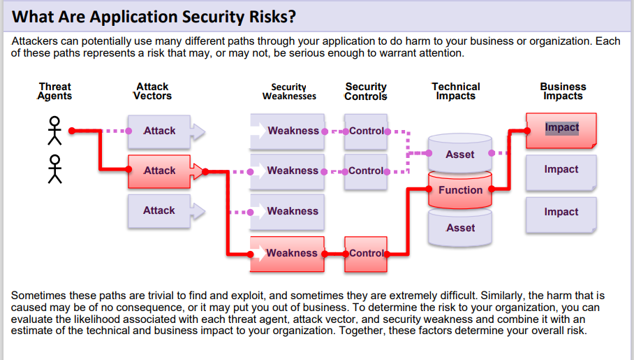
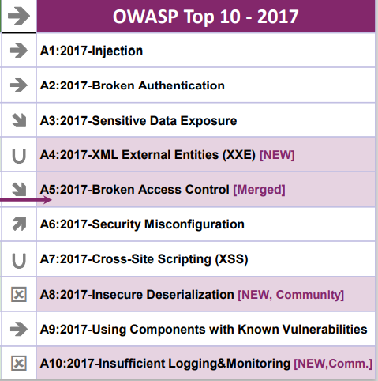

# What Are Application Security Risks?

* เมื่อเราพูดถึง Security Risks ว่าคืออะไร ก็คือความเสี่ยงที่อาจจะเกิดขึ้นกับองค์กรของเรา หรืออาจจะไม่เกิดก็ได้  เพราะว่าใน Softwear ของเรา อาจมีช่องทางที่ Hacker จะสามารถเข้าถึงได้ 
ซึ่งมี Securiry Weakness ที่ยังไม่ค่อยดีเท่าที่ควร แต่หากเกิดว่าไม่มีคนมาเข้าถึงระบบเราก็ยังไม่ถูก Hack 
แต่มันคือความเสี่ยง 
จากภาพด้านบนคือตัวอย่างของรูปของความเสี่ยง ซึ่งจะมี Attacker หลายๆอย่างที่เป็นไปได้เช่น attack 10 อย่าง ที่มันเป็นไปได้

ระบบของเราก็มีความไม่ปลอดภัยอยู่ ( Securiry Weakness ) ระบบมีความไม่ปลอดภัยบางอย่าง ที่มันสามารถที่จะทำให้กระทบกับฐานข้อมูลต่างๆ เช่นใน function ของเราได้ แล้วมันก็อาจจะไปส่งผลกระทบต่อ Bussiness ที่เรา Subport อยู่ก็ได้ (Business Impacts) 
ตรงนี้มันเป็นช่องทางที่ Attack อาจจะเข้ามาทางช่องทางใดช่องทางหนึ่งเช่น Threat Agents >> Attack Vectors: Attack >> Security Weaknesses: Weaknesses >>  Security Controls: Controls >> Technical Impacts: Function>> Business Impacts: Impact (ตามช่องทางสีแดง
ใน Flowchart)  หรืออาจจะมาช่องทางอื่น ขึ้นอยู่กับว่าเขาเลือกที่จะเข้าช่องทางไหน แต่ไม่ว่าอย่างไรก็ตามถ้าโปรแกรมของเรามีความเสี่ยงมันก็จะไม่ค่อยปลอดภัยแล้ว เพราะฉะนั้นสิ่งที่เราควรจะทำก็คงจะเข้าใจความเสี่ยงใน top ten เราก็เขียนโปรแกรมเพื่อลดความเสี่ยงเหล่านี้ให้มากที่สุด

** reference : https://owasp.org/www-project-top-ten/
** Author : Jaray Paensong
