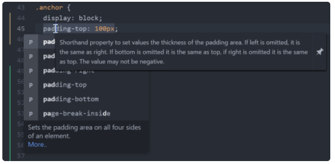
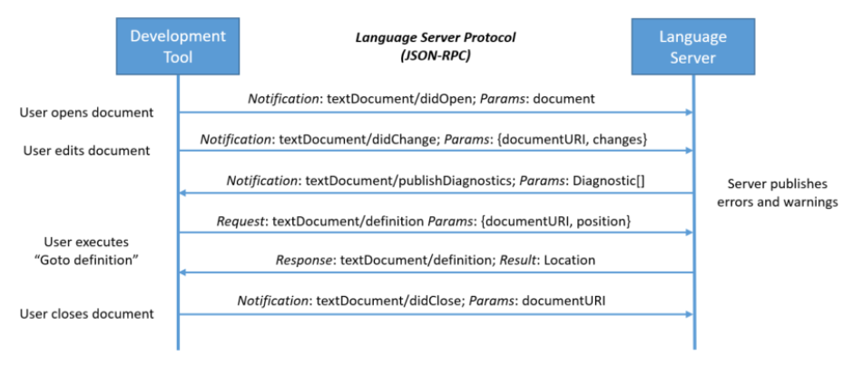
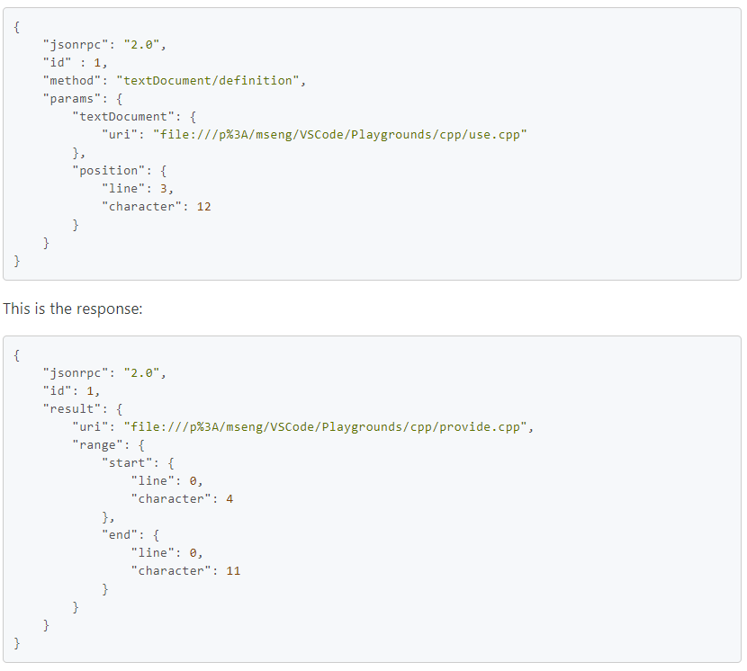
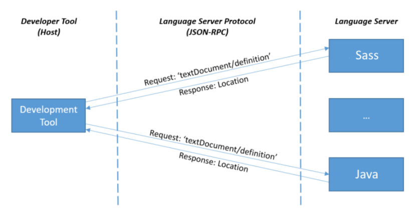

# Language Server Protocol
Language Server Protocol (LSP) กำหนด Protocol ที่ใช้ระหว่าง editor หรือ IDE และ language server ที่ให้คุณสมบัติของภาษาเช่นการเติมข้อความอัตโนมัติไปที่คำจำกัดความค้นหาการอ้างอิงทั้งหมดเป็นต้นเป้าหมายของรูปแบบ Language Server Index Format  (LSIF ออกเสียงเหมือน "else if") คือการสนับสนุนการนำทางด้วยโค้ดที่สมบูรณ์ในเครื่องมือการพัฒนาหรือ Web UI โดยไม่จำเป็นต้องมีสำเนาของซอร์สโค้ดในเครื่อง

## Language Server Protocol คืออะไร?
การเพิ่มคุณสมบัติเช่นการเติมข้อความอัตโนมัติไปที่คำจำกัดความหรือเอกสารเกี่ยวกับการวางเมาส์สำหรับภาษาโปรแกรมนั้นต้องใช้ความพยายามอย่างมาก ตามเนื้อผ้างานนี้จะต้องทำซ้ำสำหรับเครื่องมือการพัฒนาแต่ละตัวเนื่องจากแต่ละเครื่องมือมี API ที่แตกต่างกันสำหรับการใช้งานคุณลักษณะเดียวกัน

เซิร์ฟเวอร์ภาษามีไว้เพื่อจัดหาสมาร์ทเฉพาะภาษาและสื่อสารกับเครื่องมือการพัฒนาผ่านโปรโตคอลที่เปิดใช้งานการสื่อสารระหว่างกระบวนการ

แนวคิดเบื้องหลัง Language Server Protocol (LSP) คือการกำหนดมาตรฐานของโปรโตคอลสำหรับวิธีที่เซิร์ฟเวอร์และเครื่องมือการพัฒนาดังกล่าวสื่อสารกัน ด้วยวิธีนี้เซิร์ฟเวอร์ภาษาเดียวสามารถใช้ซ้ำได้ในเครื่องมือการพัฒนาหลาย ๆ ตัวซึ่งจะสามารถรองรับหลายภาษาได้โดยใช้ความพยายามเพียงเล็กน้อย

LSP ชนะทั้งผู้ให้บริการภาษาและผู้จำหน่ายเครื่องมือ!

## Language Server Protocol คืออะไร?
การใช้งานการสนับสนุนสำหรับคุณลักษณะต่างๆเช่นการเติมข้อความอัตโนมัติคำจำกัดความ goto หรือเอกสารเกี่ยวกับการวางเมาส์สำหรับภาษาโปรแกรมถือเป็นความพยายามครั้งสำคัญ ตามเนื้อผ้างานนี้ต้องทำซ้ำสำหรับเครื่องมือการพัฒนาแต่ละรายการเนื่องจากแต่ละเครื่องมือมี API ที่แตกต่างกันสำหรับการใช้งานคุณลักษณะเดียวกัน

แนวคิดเบื้องหลังเซิร์ฟเวอร์ภาษาคือการจัดหาสมาร์ทเฉพาะภาษาภายในเซิร์ฟเวอร์ที่สามารถสื่อสารกับเครื่องมือการพัฒนาผ่านโปรโตคอลที่เปิดใช้งานการสื่อสารระหว่างกระบวนการ

แนวคิดเบื้องหลัง Language Server Protocol (LSP) คือการกำหนดมาตรฐานของโปรโตคอลสำหรับวิธีการสื่อสารของเครื่องมือและเซิร์ฟเวอร์ดังนั้นเซิร์ฟเวอร์ภาษาเดียวจึงสามารถใช้ซ้ำได้ในเครื่องมือการพัฒนาที่หลากหลายและเครื่องมือสามารถรองรับภาษาได้โดยใช้ความพยายามเพียงเล็กน้อย

LSP ชนะทั้งผู้ให้บริการภาษาและผู้จำหน่ายเครื่องมือ!

## How it works
เซิร์ฟเวอร์ภาษาทำงานเป็นกระบวนการแยกต่างหากและเครื่องมือการพัฒนาสื่อสารกับเซิร์ฟเวอร์โดยใช้โปรโตคอลภาษาผ่าน JSON-RPC ด้านล่างนี้เป็นตัวอย่างวิธีที่เครื่องมือและเซิร์ฟเวอร์ภาษาสื่อสารระหว่างเซสชันการแก้ไขตามปกติ:

* ผู้ใช้เปิดไฟล์ (เรียกว่าเอกสาร) ในเครื่องมือ: เครื่องมือจะแจ้งเซิร์ฟเวอร์ภาษาว่าเอกสารเปิดอยู่ ("textDocument / didOpen") จากนี้ไปความจริงเกี่ยวกับเนื้อหาของเอกสารไม่ได้อยู่ในระบบไฟล์อีกต่อไป แต่เก็บไว้โดยเครื่องมือในหน่วยความจำ ตอนนี้เนื้อหาจะต้องซิงโครไนซ์ระหว่างเครื่องมือและเซิร์ฟเวอร์ภาษา

* ผู้ใช้ทำการแก้ไข: เครื่องมือจะแจ้งเซิร์ฟเวอร์เกี่ยวกับการเปลี่ยนแปลงเอกสาร ("textDocument / didChange") และการแสดงภาษาของเอกสารจะได้รับการอัพเดตโดยเซิร์ฟเวอร์ภาษา เมื่อเกิดเหตุการณ์นี้เซิร์ฟเวอร์ภาษาจะวิเคราะห์ข้อมูลนี้และแจ้งให้เครื่องมือทราบพร้อมข้อผิดพลาดและคำเตือนที่ตรวจพบ ("textDocument / publishedDiagnostics")

* ผู้ใช้เรียกใช้“ ไปที่คำจำกัดความ” บนสัญลักษณ์ของเอกสารที่เปิดอยู่: เครื่องมือจะส่งคำขอ 'textDocument / definition' โดยมีพารามิเตอร์สองตัว: (1) URI ของเอกสารและ (2) ตำแหน่งข้อความจากตำแหน่งที่ 'ไปที่คำจำกัดความ คำขอถูกเริ่มต้นไปยังเซิร์ฟเวอร์ เซิร์ฟเวอร์ตอบสนองด้วย URI ของเอกสารและตำแหน่งของคำจำกัดความของสัญลักษณ์ภายในเอกสาร

* ผู้ใช้ปิดเอกสาร (ไฟล์): การแจ้งเตือน "textDocument / didClose" ถูกส่งจากเครื่องมือเพื่อแจ้งเซิร์ฟเวอร์ภาษาว่าขณะนี้เอกสารไม่อยู่ในหน่วยความจำอีกต่อไป ตอนนี้เนื้อหาปัจจุบันเป็นปัจจุบันบนระบบไฟล์แล้ว

ตัวอย่างนี้แสดงให้เห็นว่าโปรโตคอลสื่อสารกับเซิร์ฟเวอร์ภาษาที่ระดับการอ้างอิงเอกสาร (URI) และตำแหน่งเอกสารอย่างไร ประเภทข้อมูลเหล่านี้เป็นภาษาโปรแกรมที่เป็นกลางและใช้ได้กับภาษาโปรแกรมทั้งหมด ชนิดข้อมูลไม่ได้อยู่ในระดับของแบบจำลองโดเมนภาษาการเขียนโปรแกรมซึ่งโดยปกติจะมีโครงสร้างไวยากรณ์ที่เป็นนามธรรมและสัญลักษณ์ของคอมไพเลอร์ (ตัวอย่างเช่นชนิดที่ได้รับการแก้ไขแล้วเนมสเปซ ... ) ความจริงที่ว่าประเภทข้อมูลนั้นเรียบง่ายและภาษาการเขียนโปรแกรมที่เป็นกลางทำให้โปรโตคอลง่ายขึ้นอย่างมาก การกำหนดมาตรฐาน URI ของเอกสารข้อความหรือตำแหน่งเคอร์เซอร์นั้นง่ายกว่ามากเมื่อเทียบกับการสร้างมาตรฐานโครงสร้างไวยากรณ์แบบนามธรรมและสัญลักษณ์คอมไพเลอร์ในภาษาโปรแกรมต่างๆ

ตอนนี้เรามาดูคำขอ "textDocument / definition" โดยละเอียด ด้านล่างนี้คือเพย์โหลดที่อยู่ระหว่างเครื่องมือพัฒนาและเซิร์ฟเวอร์ภาษาสำหรับคำขอ“ ไปที่คำจำกัดความ” ในเอกสาร C ++

## This is the request:

เมื่อผู้ใช้ทำงานกับภาษาที่แตกต่างกันเครื่องมือในการพัฒนามักจะเริ่มต้นเซิร์ฟเวอร์ภาษาสำหรับภาษาการเขียนโปรแกรมแต่ละภาษา ตัวอย่างด้านล่างแสดงเซสชันที่ผู้ใช้ทำงานบนไฟล์ Java และ SASS

## Capabilities
เซิร์ฟเวอร์บางภาษาไม่สามารถรองรับคุณลักษณะทั้งหมดที่กำหนดโดยโปรโตคอล LSP จึงมี "ความสามารถ" ความสามารถจัดกลุ่มชุดคุณสมบัติภาษา เครื่องมือพัฒนาและเซิร์ฟเวอร์ภาษาประกาศคุณสมบัติที่รองรับโดยใช้ความสามารถ ตัวอย่างเช่นเซิร์ฟเวอร์ประกาศว่าสามารถจัดการคำขอ "textDocument / definition" ได้ แต่อาจไม่รองรับคำขอ "พื้นที่ทำงาน / สัญลักษณ์" ในทำนองเดียวกันเครื่องมือพัฒนาประกาศความสามารถในการแจ้งเตือน "กำลังจะบันทึก" ก่อนบันทึกเอกสารเพื่อให้เซิร์ฟเวอร์สามารถคำนวณการแก้ไขข้อความเพื่อจัดรูปแบบเอกสารที่แก้ไขก่อนที่จะบันทึก

โปรดสังเกตว่าการรวมเซิร์ฟเวอร์ภาษาเข้ากับเครื่องมือเฉพาะไม่ได้กำหนดโดยโปรโตคอลเซิร์ฟเวอร์ภาษาและถูกปล่อยให้เป็นผู้ใช้เครื่องมือ

## Libraries (SDKs) for LSP providers and consumers
เพื่อลดความซับซ้อนในการใช้งานเซิร์ฟเวอร์ภาษาและไคลเอนต์มีไลบรารีหรือ SDK:

SDK เครื่องมือการพัฒนาโดยทั่วไปแล้วเครื่องมือการพัฒนาแต่ละรายการจะมีไลบรารีสำหรับการรวมเซิร์ฟเวอร์ภาษา ตัวอย่างเช่นสำหรับ JavaScript / TypeScript จะมีโมดูล npm ของไคลเอ็นต์ภาษา

Language Server SDK สำหรับภาษาการใช้งานที่แตกต่างกันมี SDK สำหรับติดตั้งเซิร์ฟเวอร์ภาษาในภาษาใดภาษาหนึ่ง ตัวอย่างเช่นในการติดตั้งเซิร์ฟเวอร์ภาษาโดยใช้ Node.js จะมีโมดูล npm ของเซิร์ฟเวอร์ภาษา

## Implementations
Language Servers
If you are missing a server please create a pull request in GitHub against this markdown document

Language	Maintainer	Repository	Implementation Language
1C Enterprise	Contributors	BSL Language Server	Java
ActionScript 2.0	Adam Vernon	AS2 Language Support	TypeScript
Ada/SPARK	AdaCore	ada_language_server	Ada
Antlr	Ken Domino	Antlrvsix	C#
API Elements	Vincenzo Chianese(@XVincentX)	vscode-apielements	TypeScript
Apache Camel	Contributors	Apache Camel Language Server	Java
Apex	Salesforce	VS Code Apex extension	TypeScript
Ballerina	Ballerina.io	Ballerina Language Server	Java
Bash	Mads Hartmann	Bash Language Server	TypeScript
BrightScript/BrighterScript	RokuCommunity	brighterscript	TypeScript
C#	OmniSharp	csharp-language-server-protocol	C#
C++	MS	VS Code C++ extension	C++
C++/clang	LLVM Project	clangd	C++
C/C++/Objective-C	Jacob Dufault, MaskRay, topisani	cquery	C++
C/C++/Objective-C	MaskRay	ccls	C++
CSS/LESS/SASS	MS	vscode-css-languageserver	TypeScript
Ceylon	John Vasileff	vscode-ceylon	Ceylon
Clojure	Case Nelson	clojure-lsp	Clojure
IBM Enterprise COBOL for z/OS	Broadcom	COBOL Language Support	Java
IBM High Level Assembler	Broadcom	HLASM Language Support	C++
IBM High Level Assembler	IBM	IBM Z Open Editor VS Code extension	Java
IBM Enterprise COBOL for z/OS	IBM	IBM Z Open Editor VS Code extension	Java
CodeQL	GitHub	codeql	Java
CWL	Rabix	Benten	Python
Crane PHP	HvyIndustries	VS Code Extension	TypeScript
Crystal	Elbaz Julien	Crystalline	Crystal
Crystal	Ryan L. Bell	Scry	Crystal
D	Jan Jurzitza	serve-d	D
D	Laurent Tréguier	D Language Server	D
Dart	Dart Team	Dart SDK	Dart
Data Pack	SPGoding	Data-pack Language Server	TypeScript
Delphi	Embarcadero	Proprietary (DelphiLSP)	Delphi and C
Dockerfiles	Remy Suen	dockerfile-language-server	TypeScript
DreamMaker	SpaceManiac	DreamMaker Language Server	Rust
Erlang	OTP, Vlad Dumitrescu	sourcer	Erlang
Erlang	Roberto Aloi and Contributors	erlang_ls	Erlang
Elixir	Elixir LSP	elixir-ls	Elixir
Elm	Kolja Lampe	elmLS	Typescript
Ember	Ember community	ember language server	TypeScript
F#	@georgewfraser	F# Language Server	F#
F#	@Krzysztof-Cieslak & Contributors	FsAutoComplete	F#
Fortran	Chris Hansen	fortran-language-server	Python
GLSL	Sven-Hendrik Haase (@svenstaro)	glsl-language-server	C++
Gauge	Gauge	Gauge Language Server	Go
GDScript	GodotEngine	Godot	C++
Gluon	Gluon	Gluon Language Server	Rust
Go	Go Team	gopls	Go
Go	Sourcegraph	sourcegraph-go	Go
GraphQL	GraphQL Foundation	Official GraphQL Language Server	TypeScript
GraphQL	Mayank Agarwal (@Mayank1791989)	GQL Language Server	JavaScript
Groovy	Palantir	groovy-language-server	Java
Groovy	Prominic.NET	Groovy Language Server	Java
Groovy	VsCode Groovy Lint	VsCode Groovy Lint Language Server	TypeScript
HTML	MS	vscode-html-languageserver	TypeScript
Haskell	Alan Zimmerman	Haskell Language Server (HLS)	Haskell
Haxe	Haxe Foundation	Haxe Language Server	Haxe
HLSL	Tim Jones	HLSL Tools	C#
Isabelle	Makarius Wenzel	sources	Scala
JSON	MS	vscode-json-languageserver	TypeScript
Java (Eclipse)	Eclipse, RedHat	Eclipse JDT LS	Java
Java	@georgewfraser	Java Compiler (javac) API-based Java support	Java
Javascript Flow	Facebook, Inc.	flow	OCaml, JavaScript
Javascript Flow	flowtype	flow-language-server(deprecated)	JavaScript, Flow
Javascript-Typescript	Sourcegraph	javascript-typescript	TypeScript
Julia	Contributors	Julia language server	Julia
Kerboscript (kOS)	John Chabot	kos-language-server	Typescript
Kotlin	@fwcd	kotlin-language-server	Kotlin
Language Server Robot	TypeCobolTeam	TypeCobol Language Server Robot	C#
Language Tool	Adam Voss	languagetool	Java
LaTeX	Eric Förster	texlab	 
Lua	Kyle McLamb	lua-lsp	Lua
Lua	最萌小汐	lua-language-server	Lua
MSBuild	Adam Friedman	msbuild-project-tools-vscode	TypeScript
Nim	Peter Munch-Ellingsen	nimlsp	Nim
OCaml/Reason	freebroccolo	ocaml-language-server	TypeScript
OCaml/Reason	OCaml Labs	ocamllsp	OCaml
openVALIDATION	openVALIDATION	ov-language-server	TypeScript
Papyrus	Joel Day	papyrus-lang	C#
Perl	GRICHTER	Perl::LanguageServer	Perl
PHP	Ben Mewburn	inteliphense	TypeScript
PHP	Felix Becker	php-language-server	PHP
PHP	Tom Gerrits	Serenata	PHP
PHP	Tyson Andre	Phan	PHP
PHPUnit	Recca0120	phpunit-language-server	TypeScript
IBM Enterprise PL/I for z/OS	IBM	IBM Z Open Editor VS Code extension	Java
Polymer	Polymer Team	polymer-editor-service	TypeScript
PowerPC Assembly	Noah Fields	PowerPC Support	TypeScript
PowerShell	MS	PowerShell Editor Services	C#
PromQL	Tobias Guggenmos	promql-langserver	Go
PureScript	Nicholas Wolverson	purescript-language-server	PureScript
Puppet	Lingua Pupuli	puppet language server	Ruby
Python	Fabio Zadrozny	PyDev on VSCode	Java, Python
Python	Palantir Technologies	python-language-server	Python
Python	MS	python-language-server	C#
Q#	MS	Q# Language Server	C#
R	REditorSupport	R language server	R
Racket	Jay McCarthy	racket-langserver	Racket
RAML	RAML Workgroup	raml-language-server Work in Progress	 
ReasonML	Jared Forsyth	reason-language-server	OCaml
Red	bitbegin	redlangserver	Red
ReScript	rescript-lang	rescript-vscode	TypeScript
Robot Framework	Tomi Turtiainen	VSCode RF language server	TypeScript
Robot Framework	Robocorp	robotframework-lsp	Python
Ruby	Fred Snyder	solargraph	Ruby
Ruby	Fumiaki MATSUSHIMA	language_server-ruby	Ruby
Ruby	Dmitry Petrashko	sorbet	Ruby
Ruby	Rafał Łasocha	orbacle	Ruby
Ruby	Kurt Werle	ruby_language_server	Ruby
Rust	Jonathan Turner	Rust Language Server	Rust
Rust	Aleksey Kladov	Rust Analyzer	Rust
T-SQL	MS	VS Code SQL extension	TypeScript, Binary
Scala	Iulian Dragos	dragos-vscode-scala	Scala
Scala	Scalameta	Metals	Scala
Smalltalk/Pharo	Benoît Verhaeghe	Pharo Language Server	Pharo
SPARQL	Stardog Union	SPARQL Language Server	TypeScript
Stylable	Wix.com	stylable/language-service	TypeScript
Svelte	UnwrittenFun	svelte-language-server	TypeScript
Swift	Apple	SourceKit-LSP	Swift
Sysl	ANZ Bank	Sysl LSP	Go
SystemVerilog	dalance	svls	Rust
Terraform	Julio Tain Sueiras	terraform-lsp	Go
Terraform	HashiCorp	terraform-ls	Go
Tibbo Basic	Tibbo	tibbo-basic	Tibbo Basic
TTCN-3	Nokia	ntt	Go
Turtle	Stardog Union	Turtle Language Server	TypeScript
TypeCobol	TypeCobol	TypeCobol language server	C#
TypeScript	TypeFox	typescript-language-server	TypeScript
Vala	Ben Iofel, Princeton Ferro	vala-language-server	Vala
VDM-SL, VDM++, VDM-RT	Nick Battle	VDMJ-LSP	Java
VHDL	Olof Kraigher	vhdl_ls	Rust
Viml	iamcco	vim-language-server	Typescript
Visualforce	Salesforce	VS Code Visualforce extension	 
Vue	Pine Wu & @HerringtonDarkholme	vuejs/vetur	TypeScript
WebAssembly	Darin Morrison	wasm-language-server	Rust
Wolfram Language (Mathematica)	kenkangxgwe	lsp-wl	Wolfram Language
WXML	Qiming Zhao	wxml-languageserver	TypeScript
XML	IBM	XML Language Server	Java
XML	Red Hat Developers and Angelo ZERR	XML Language Server (LemMinX)	Java
Xtext language framework	Eclipse	Eclipse Xtext	Java
YAML (with JSON schemas)	Adam Voss	vscode-yaml-languageservice	TypeScript
YAML	Red Hat Developers	yaml-language-server	TypeScript
YANG	Yang tools	yang-lsp	XTend
*	mattn	efm-langserver	Go

Author : Jaray Paensong

