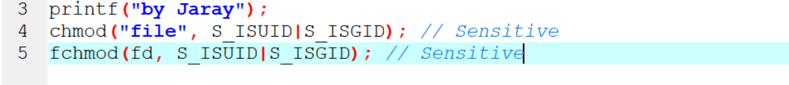

# Setting capabilities is security-sensitive
##
* Linux มีความสามารถช่วยให้คุณกำหนดสิทธิ์ของ Root ให้กับไฟล์หรือกระบวนการต่าง ๆ ให้แคบลง
thread ที่มีความสามารถข้ามการตรวจสอบความปลอดภัยของ kernel ตามปกติ เพื่อดำเนินการ actions
ที่มีสิทธิ์สูง เช่น การต่ออุปกรณ์เข้ากับ directory โดยไม่ต้องใช้สิทธิ์ root (เพิ่มเติม)
การให้ความสามารถอาจนำไปสู่การยกระดับสิทธิ์
##
Ask Yourself Whether
Capabilities are granted:
* ไปยังกระบวนการที่ไม่ต้องการความสามารถทั้งหมดในการทำงาน
* ไปยังกระบวนการที่ไม่น่าเชื่อถือ
มีความเสี่ยงหากคุณตอบว่าใช่สำหรับคำถามเหล่านั้น
##
Recommended Secure Coding Practices
* แนวทางปฏิบัติในการเข้ารหัสที่ปลอดภัยที่แนะนำ ความสามารถเป็นสิทธิพิเศษที่สูงโดยปกติแล้วจะเชื่อมโยงกับ superuser (root) ดังนั้นตรวจสอบให้แน่ใจว่าได้กำหนดความสามารถที่ จำกัด และจำเป็นที่สุดให้กับไฟล์และกระบวนการ

Sensitive Code Example
เมื่อตั้งค่าความสามารถ:

When setting SUID/SGID attributes:

