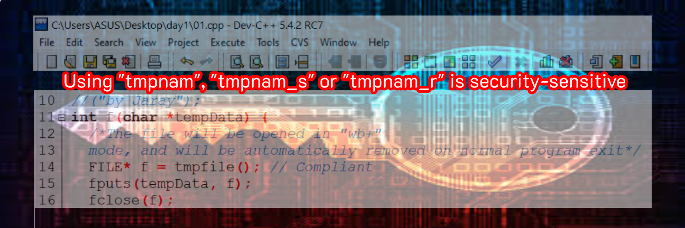
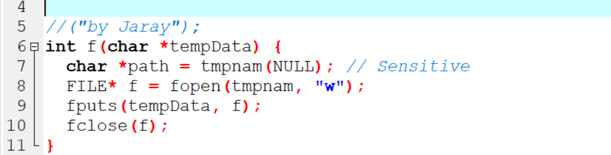
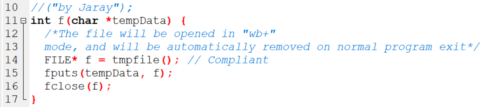

# Using "tmpnam", "tmpnam_s" or "tmpnam_r" is security-sensitive

* "tmpnam", "tmpnam_s" และ "tmpnam_r" เป็น Function ที่ใช้เพื่อส่งคืนชื่อที่ไม่ตรงกับไฟล์ที่มีอยู่เพื่อให้ Application สร้างไฟล์ชั่วคราว 
* อย่างไรก็ตามแม้ว่าไฟล์จะไม่มีอยู่ในเวลาที่เรียกใช้ฟังก์ชันเหล่านั้น แต่ก็อาจมีอยู่เมื่อ Application นั้นพยายามใช้ชื่อไฟล์เพื่อสร้างไฟล์ 
* Hacker จะใช้สิ่งนี้เพื่อเข้าถึงไฟล์ที่ Application เชื่อว่าน่าเชื่อถือ

* มีฟังก์ชันอื่นนอกเหนือจากการสร้างชื่อไฟล์ที่เหมาะสมแล้วให้สร้างและเปิดไฟล์และส่งคืนตัวจัดการไฟล์ ฟังก์ชันดังกล่าวได้รับการปกป้องจากเวกเตอร์
การโจมตีนี้และควรเป็นที่ต้องการ เหตุผลเดียวที่จะใช้ฟังก์ชันเหล่านี้คือการสร้างโฟลเดอร์ชั่วคราวไม่ใช่ไฟล์ชั่วคราว

* นอกจากนี้ฟังก์ชันเหล่านี้อาจไม่ปลอดภัยต่อ Thread และหากไม่ได้ระบุ Buffer ที่มีขนาดเพียงพอจะทำให้มี Buffers ล้นออกมา

### Ask Yourself Whether

* มีความเป็นไปได้ที่หลาย Thread จะเรียกใช้ฟังก์ชันเหล่านี้พร้อมกัน
* มีความเป็นไปได้ที่ไฟล์ผลลัพธ์จะถูกเปิดโดยไม่ต้องบังคับให้สร้าง ซึ่งหมายความว่าไฟล์นั้นอาจมีสิทธิ์การเข้าถึงได้โดยที่ไม่ได้คาดคิดไว้
* Buffer ที่ส่งผ่านไปยังฟังก์ชันเหล่านี้มีขนาดเล็กกว่าตามลำดับ

  * L_tmpnam for tmpnam
  * L_tmpnam_s for tmpnam_s
  * L_tmpnam for tmpnam_r
  
### There is a risk if you answered yes to any of those questions
 
 
### Recommended Secure Coding Practices
 
* ใช้ฟังก์ชันที่เปิดไฟล์ชั่วคราวโดยตรงเช่น tmpfile, tmpfile_s, mkstemp หรือ mkstemps (สองตัวสุดท้ายอนุญาตให้ควบคุมชื่อไฟล์ได้แม่นยำยิ่งขึ้น)
* หากคุณไม่สามารถกำจัดฟังก์ชันเหล่านี้ได้เมื่อใช้ชื่อที่สร้างขึ้นเพื่อเปิดไฟล์ให้ใช้ฟังก์ชันที่บังคับให้สร้างไฟล์และจะล้มเหลวหากมีไฟล์อยู่แล้ว

### Sensitive Code Example

### Compliant Solution

Author : Jaray Paensong
