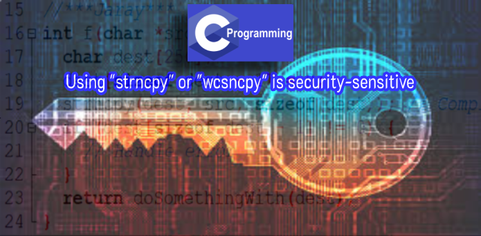
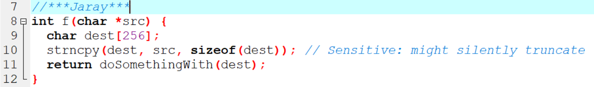
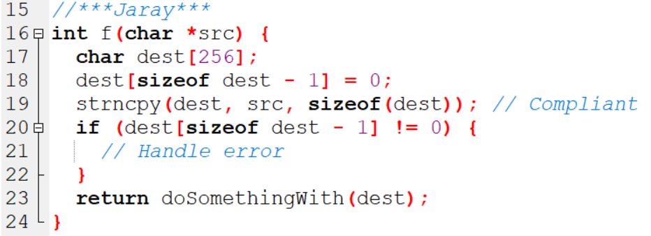

# Using "strncpy" or "wcsncpy" is security-sensitive

* ในภาษา C string เป็นเพียง buffer ของอักขระโดยปกติจะใช้อักขระ null character  เป็นที่สังเกตสำหรับจุดสิ้นสุดของ string ซึ่งหมายความว่าผู้พัฒนาจะต้องตระหนักถึงรายละเอียด low-level 
เช่นขนาด บั buffer  หรือมีอักขระพิเศษเพื่อเก็บอักขระว่างสุดท้าย การทำอย่างถูกต้องและสม่ำเสมอถือเป็นเรื่องยากอย่างยิ่งและข้อผิดพลาด อาจนำไปสู่ช่องโหว่ด้านความปลอดภัยตัวอย่างเช่นการอนุญาตให้เข้าถึง
ข้อมูลที่ละเอียดอ่อนหรืออนุญาตให้ใช้รหัสโดยอิสระ
*  ฟังก์ชัน char * strncpy (char * restrict dest, const char * restrict src, size_t count); คัดลอกอักขระตัวแรกนับอักขระจาก src 
ไปยัง dest หยุดที่อักขระ null ตัวแรก และเติมช่องว่างพิเศษด้วย 0 wcsncpy ทำเช่นเดียวกันสำหรับความกว้างอักขระและควรใช้กับแนวทางเดียวกัน
ฟังก์ชันทั้งสองได้รับการออกแบบมาเพื่อทำงานกับ strings ที่มีความยาวคงที่ และสตริงอาจมีผลลัพธ์ที่ไม่สิ้นสุดด้วยค่าว่าง

## Ask Yourself Whether

* มีความเป็นไปได้ที่ pointer ต้นทางหรือปลายทางเป็นค่า null
* ความปลอดภัยของระบบของคุณอาจถูกบุกรุกได้หากปลายทางไม่ใช่เต็ม
* buffer ต้นทางสามารถเป็นได้ทั้งnon-null-terminated และ มีขนาดเล็กกว่าจำนวนนับ
* buffer ปลายทางอาจมีขนาดเล็กกว่าจำนวนนับ
* คุณคาดว่าปลายทางจะเป็น null-terminated string
* มีความทับซ้อนระหว่างต้นทางและปลายทาง

## Recommended Secure Coding Practices

* C11  (C standard revision) จัดเตรียมไว้ในภาคผนวก K, strncpy_s และ wcsncpy_s ที่ได้รับการออกแบบให้เป็นทางเลือกที่ปลอดภัยกว่าสำหรับ strcpy และ wcscpy ไม่แนะนำให้ใช้ในทุกสถานการณ์เนื่องจากแนะนำต้นทุนเวลาในการทำงานและจำเป็นต้องเขียนโค้ดเพิ่มเติมสำหรับการจัดการข้อผิดพลาด แต่จะทำการตรวจสอบที่จะ จำกัด ผลที่ตามมาของการเรียก function ด้วย arguments ที่ไม่ถูกต้อง
* แม้ว่า compiler ของคุณจะไม่รองรับภาคผนวก K อย่างแน่นอน แต่คุณอาจเข้าถึง function ที่คล้ายกันได้
* หากคุณใช้ strncpy และ wsncpy เป็นเวอร์ชันที่ปลอดภัยกว่าของ strcpy และ wcscpy คุณควรพิจารณา strcpy_s และ wcscpy_s แทนเนื่องจาก function เหล่านี้มีข้อบกพร่องหลายประการ:
  ** ไม่ใช่เรื่องง่ายที่จะตรวจจับการตัดทอน
  ** มีการทำงานมากเกินไปในการเติม buffer  ด้วย 0 ซึ่งนำไปสู่ประสิทธิภาพที่ไม่เหมาะสม
  ** หากไม่ได้รับการแก้ไขด้วยตนเอง string ปลายทางอาจไม่สิ้นสุดด้วยค่า null
* หากคุณต้องการใช้ฟังก์ชัน strcpy และ wcscpy และตรวจสอบว่าstring ถูกตัดทอนหรือไม่รูปแบบดังต่อไปนี้:
  ** ตั้งค่าอักขระสุดท้ายของ buffer เป็น null
  ** เรียกใช้ function
  ** ตรวจสอบว่าอักขระสุดท้ายของ buffer ยังคงเป็นโมฆะหรือไม่
* หากคุณกำลังเขียนโค้ด C ++ การใช้ std :: string เพื่อจัดการกับ string นั้นง่ายกว่ามากและมีข้อผิดพลาดน้อยกว่า

## Sensitive Code Example

## Compliant Solution

