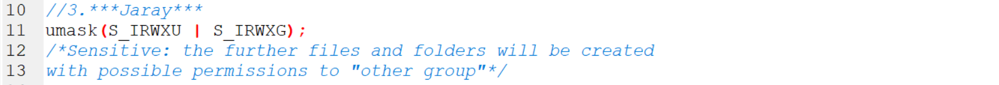

# Setting loose POSIX file permissions is security-sensitive

* ใน Unix คลาส "others" หมายถึงผู้ใช้ทั้งหมดยกเว้นเจ้าของไฟล์และสมาชิกของกลุ่มที่กำหนดให้กับไฟล์นี้

* การให้สิทธิ์แก่กลุ่มนี้อาจนำไปสู่การเข้าถึงไฟล์โดยไม่ได้ตั้งใจ 

## Ask Yourself Whether

* Application ได้รับการออกแบบให้ทำงานบนสภาพแวดล้อมที่มีผู้ใช้หลายคน
files และ directories ที่เกี่ยวข้องอาจมีข้อมูลที่เป็นความลับ

There is a risk if you answered yes to any of those questions.

## Recommended Secure Coding Practices

* ควรกำหนดสิทธิ์ที่ จำกัด มากที่สุดให้กับ files และ directories

## Sensitive Code Example

* เมื่อสร้าง file หรือ directory ที่มีสิทธิ์สำหรับ "กลุ่มอื่น"

* เมื่อเพิ่มสิทธิ์อย่างชัดเจนใน "กลุ่มอื่น" ด้วยฟังก์ชัน chmod, fchmod หรือ filesystem :: permissions:

* เมื่อคำสั่งที่ใช้่กำหนดโดยไม่ต้องอ่านให้เขียนและดำเนินการสิทธิ์สำหรับ "กลุ่มอื่น":

## Compliant Solution

* เมื่อสร้าง file หรือ directory อย่าตั้งค่าสิทธิ์เป็น "กลุ่มอื่น":

* เมื่อใช้ฟังก์ชัน chmod, fchmod หรือ filesystem :: permissions อย่าเพิ่มสิทธิ์ให้กับ "กลุ่มอื่น":

* เมื่อคำสั่งที่ใช้่กำหนดให้ตั้งค่าสิทธิ์อ่านเขียนและดำเนินการกับกลุ่มอื่น:

Author : Jaray Paensong

Ref : https://rules.sonarsource.com/c/type/Security%20Hotspot/RSPEC-5816
