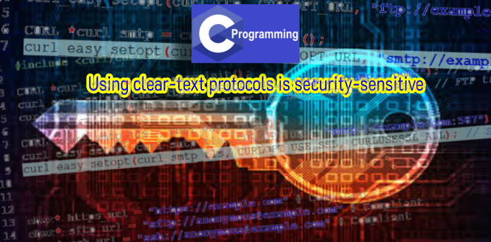
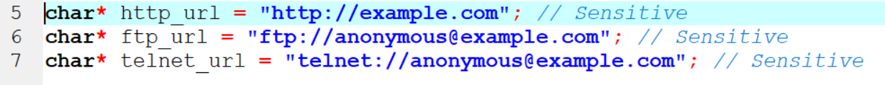
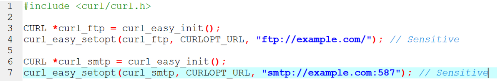
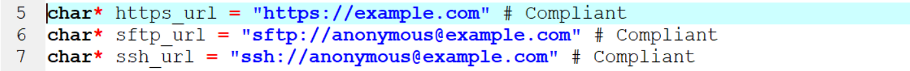
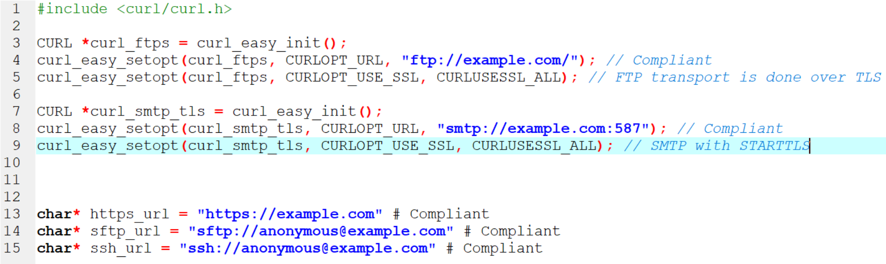

# Using clear-text protocols is security-sensitive

* โปรโตคอล Clear-text เป็น ftp, telnet หรือ http ที่ไม่ปลอดภัยนั้นขาดการเข้ารหัสที่ใช้ขนส่งข้อมูล นอกจากนี้ยังขาดความสามารถในการสร้างการเชื่อมต่อที่พิสูจน์ตัวตน ซึ่งหมายความว่าผู้โจมตีที่สามารถดักจับปริมาณการใช้งานจากเครือข่ายสามารถอ่านแก้ไขหรือทำให้เนื้อหาที่ขนส่งเสียหายได้ โปรโตคอลเหล่านี้ไม่ปลอดภัยเนื่องจากทำให้ Application มีความเสี่ยงมากมาย:
  * การเปิดเผยข้อมูลที่ Sensitive
  * เปลี่ยนเส้นทางการจราจรไปยังปลายทางที่เป็นอันตราย
  * การอัปเดตซอฟต์แวร์หรือตัวติดตั้งซอฟต์แวร์ที่ติดมัลแวร์
  * การดำเนินการของรหัสฝั่งไคลเอ็นต์
  * การทุจริตของข้อมูลที่สำคัญ
  
Note : การใช้โปรโตคอล http จะถูกเลิกใช้งานโดยเว็บเบราว์เซอร์หลัก ๆ

* ในอดีตที่ผ่านมาได้นำไปสู่ช่องโหว่ดังต่อไปนี้:
  * CVE-2019-6169
  * CVE-2019-12327
  * CVE-2019-11065
  
## Ask Yourself Whether
 
  * การรักษาความลับและความสมบูรณ์ของข้อมูลเป็นสิ่งที่จำเป็นในบริบทของเว็บแอปพลิเคชัน
  * ข้อมูลจะถูกแลกเปลี่ยนบนเครือข่ายที่เปิดเผย (อินเทอร์เน็ตเครือข่ายสาธารณะ ฯลฯ )
  มีความเสี่ยงหากคุณตอบว่าใช่สำหรับคำถามเหล่านั้น
  
  ## Recommended Secure Coding Practices
  
  * ใช้ ssh เป็นทางเลือกแทน telnet  
  * ใช้ sftp, scp หรือ ftps แทน ftp
  * ใช้ https แทน http
  * ช้ SMTP ผ่าน SSL / TLS หรือ SMTP กับ STARTTLS แทน SMTP แบบข้อความชัดเจน
  
ขอแนะนำให้รักษาความปลอดภัยช่องทางการขนส่งทั้งหมด (เครือข่ายภายในของเหตุการณ์) เนื่องจากอาจใช้การเชื่อมต่อที่ไม่ปลอดภัยเพียงครั้งเดียวเพื่อบุกรุก Application หรือระบบทั้งหมด

## Sensitive Code Example

## Compliant Solution

## Exceptions

ไม่มีการรายงานปัญหาสำหรับกรณีต่อไปนี้เนื่องจากไม่ถือว่ามีความละเอียดอ่อน:

* โครงร่างโปรโตคอลที่ไม่ปลอดภัยตามด้วยที่อยู่ย้อนกลับเช่น

Author : Jaray Paensong

Ref : https://rules.sonarsource.com/c/type/Security%20Hotspot/RSPEC-5332
