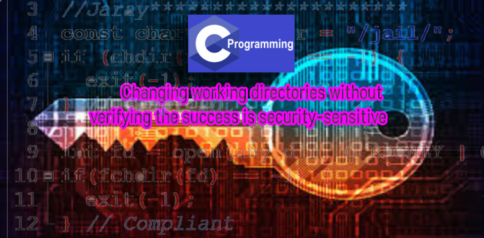

# Changing working directories without verifying the success is security-sensitive

* วัตถุประสงค์ของการเปลี่ยน directory การทำงานปัจจุบันคือการแก้ไข base path เมื่อกระบวนการดำเนินการแก้ปัญหา relative path เมื่อไม่สามารถเปลี่ยน directory การทำงานได้กระบวนการจะเก็บ directory ที่กำหนดไว้ก่อนหน้านี้เป็นdirectory การทำงานที่ใช้งานอยู่ ดังนั้นการตรวจสอบความสำเร็จของฟังก์ชันประเภท chdir () จึงมีความสำคัญในการป้องกันเส้นทางสัมพัทธ์ที่ไม่ได้ตั้งใจและการเข้าถึงโดยไม่ได้รับอนุญาต

## Ask Yourself Whether
* ความสำเร็จของการเปลี่ยน directory เป็นการทำงานเกี่ยวข้องกับ application
* ต้องเปลี่ยน directory การทำงานเพื่อให้ root ใหม่มีประสิทธิภาพ
* disk operations ภายหลังเป็นการ relative path
มีความเสี่ยงหากคุณตอบว่าใช่สำหรับคำถามเหล่านั้น

## Recommended Secure Coding Practices
หลังจากเปลี่ยน working directory ปัจจุบันให้ตรวจสอบความสำเร็จของการดำเนินการและจัดการข้อผิดพลาด

## Sensitive Code Example
การดำเนินการ chdir อาจล้มเหลวและกระบวนการยังคงสามารถเข้าถึงทรัพยากรที่ไม่ได้รับอนุญาต คืนค่ารหัสที่ควรได้รับการตรวจสอบ:

## Compliant Solution
ตรวจสอบรหัสส่งคืนของ chdir และจัดการข้อผิดพลาด:

Author : Jaray Paensong

Ref : https://rules.sonarsource.com/c/type/Security%20Hotspot/RSPEC-5982
