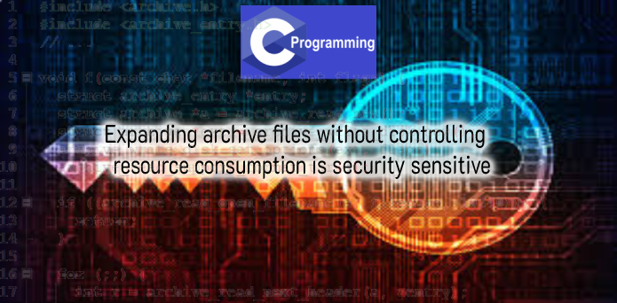
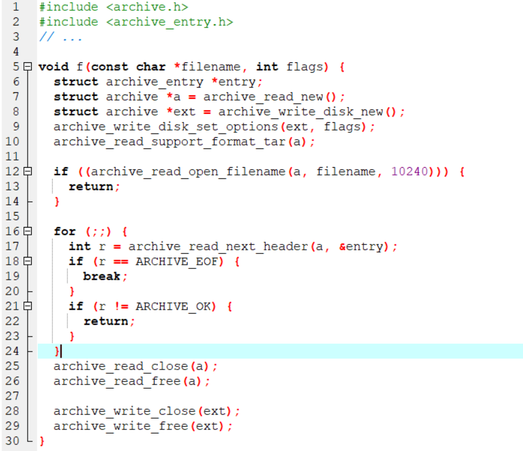
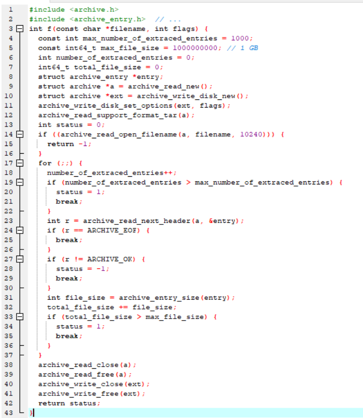

# Expanding archive files without controlling resource consumption is security sensitive

การโจมตี Zip Bomb ที่ประสบความสำเร็จเกิดขึ้นเมื่อ application ขยายไฟล์เก็บถาวรที่ไม่น่าเชื่อถือโดยไม่มีการควบคุมขนาดของข้อมูลที่ขยายซึ่งอาจนำไปสู่การปฏิเสธการให้บริการ Zip Bomb มักเป็นไฟล์เก็บถาวรที่เป็นอันตรายซึ่งมีข้อมูลบีบอัดไม่กี่กิโลไบต์ แต่กลายเป็นข้อมูลที่ไม่มีการบีบอัดขนาดกิกะไบต์ เพื่อให้ได้อัตราส่วนการบีบอัดที่รุนแรงนี้ผู้โจมตีจะบีบอัดข้อมูลที่ไม่เกี่ยวข้อง (เช่นสตริงยาวของไบต์ที่ซ้ำกัน) 1

## Ask Yourself Whether

## Recommended Secure Coding Practices

## Sensitive Code Example

## Compliant Solution

Author : Jaray Paensong

Ref : https://rules.sonarsource.com/c/type/Security%20Hotspot/RSPEC-5042
